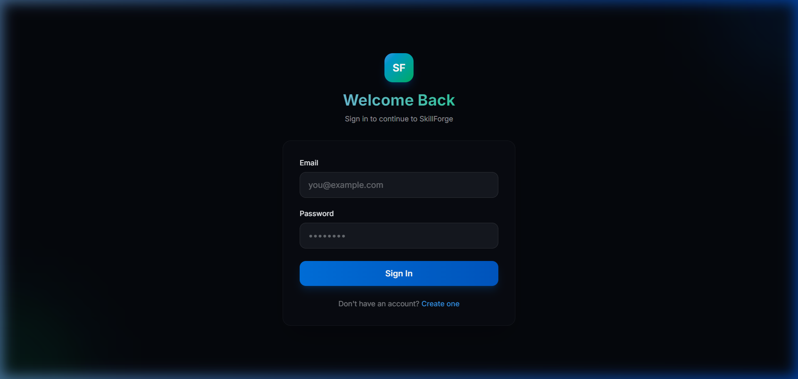
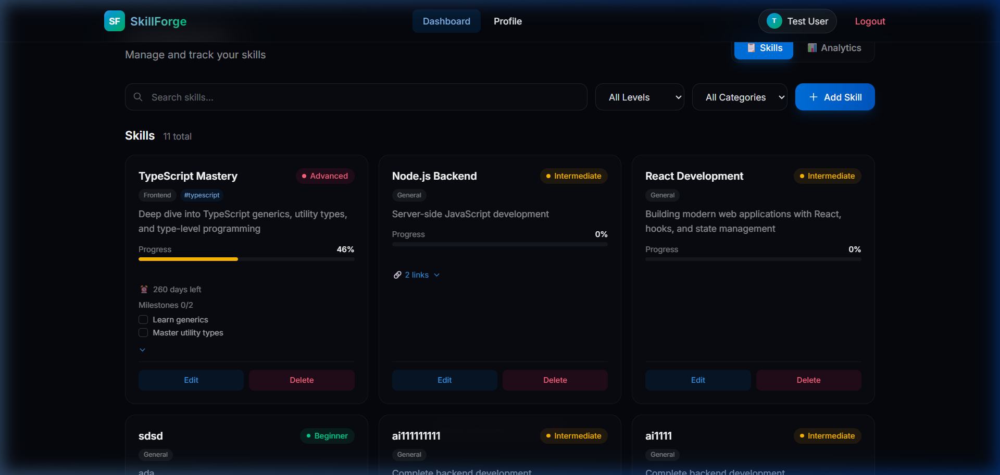
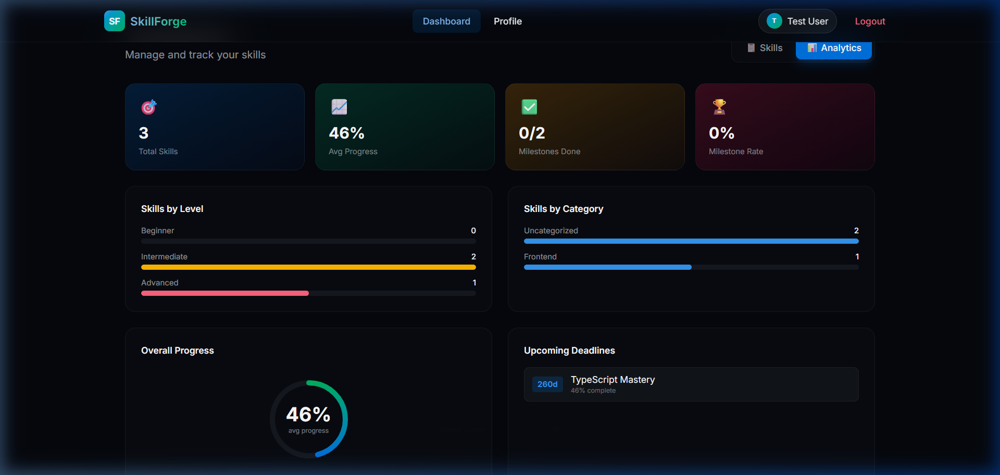
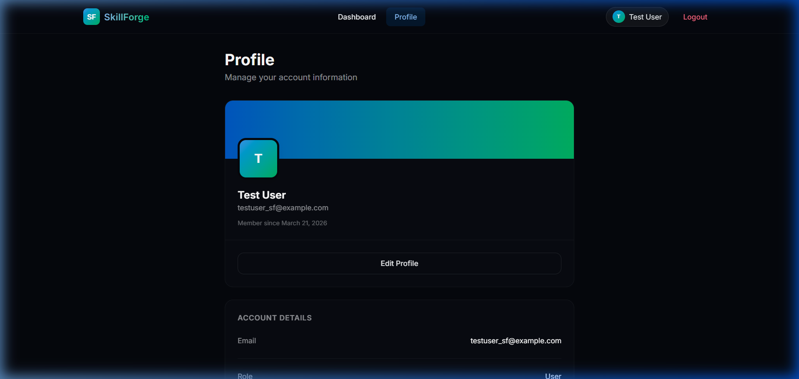

<div align="center">

# ⚒️ SkillForge

**A modern full-stack skill management platform to track, organize and master your skills.**

Built with React · Node.js · MongoDB · TypeScript

[](LICENSE)
[](https://nodejs.org)
[](https://react.dev)
[](https://mongodb.com)
[](https://www.typescriptlang.org)

### 🚀 Live Demo: [https://skills-forge-project.vercel.app](https://skills-forge-project.vercel.app/)
*(Backend API is hosted on Render at `https://skillsforgeproject.onrender.com`)*
</div>

---

## ✨ Features

### 🎯 Skill Management
- **Full CRUD** — Create, read, update, and delete skills
- **Progress Tracking** — Visual progress bars (0–100%) with inline slider updates
- **Level System** — Categorize skills as Beginner, Intermediate, or Advanced
- **Categories & Tags** — Organize skills by category (Frontend, Backend, DevOps, etc.) with custom tags

### 📚 Learning Resources
- **Resource Links** — Attach YouTube videos, LinkedIn posts, documentation, GitHub repos, and articles to any skill
- **Expandable Cards** — Click to reveal attached resources with colored type badges

### 🎯 Goals & Milestones
- **Target Dates** — Set learning deadlines with countdown timers
- **Milestone Checklists** — Break skills into milestones and track completion directly on cards
- **Deadline Alerts** — Visual warnings when deadlines approach

### 📊 Analytics Dashboard
- **KPI Cards** — Total skills, average progress, milestone completion rate
- **Bar Charts** — Skills breakdown by level and category
- **Progress Ring** — SVG circular progress visualization
- **Upcoming Deadlines** — At-a-glance view of approaching goals

### 🔐 Authentication & Security
- **JWT Authentication** — Secure token-based auth with bcrypt password hashing
- **Role-Based Access** — User and Admin roles with appropriate permissions
- **Security Headers** — Helmet, CORS, and rate limiting

### 🎨 Premium UI
- **Dark Mode** — Beautiful dark theme with oklch color system
- **Glassmorphism** — Frosted glass card effects with backdrop blur
- **Responsive** — Mobile-first design with collapsible navigation
- **Micro-animations** — Smooth transitions and hover effects

---

## 📸 Screenshots

<div align="center">

| Login | Dashboard |
|:---:|:---:|
|  |  |

| Analytics | Profile |
|:---:|:---:|
|  |  |

</div>

---

## 🏗️ Tech Stack

| Layer | Technology |
|-------|-----------|
| **Frontend** | React 19, TypeScript, Vite, Tailwind CSS v4 |
| **Backend** | Express 5, TypeScript, Node.js 18+ |
| **Database** | MongoDB Atlas, Mongoose ODM |
| **Auth** | JWT, bcryptjs |
| **Validation** | Zod |
| **Security** | Helmet, express-rate-limit, CORS |

---

## 🚀 Getting Started

### Prerequisites
- **Node.js** 18+ and **npm**
- **MongoDB** (local or [MongoDB Atlas](https://www.mongodb.com/atlas))

### 1. Clone the repository

```bash
git clone https://github.com/msdianprince-7/SkillsForgeProject.git
cd SkillsForgeProject
```

### 2. Set up the server

```bash
cd server
npm install
```

Create a `.env` file in `server/`:

```env
PORT=5000
MONGO_URI=mongodb+srv://<username>:<password>@cluster.mongodb.net/skillforge
JWT_SECRET=your-super-secret-jwt-key
NODE_ENV=development
```

### 3. Set up the client

```bash
cd ../client
npm install
```

### 4. Run the application

**Start the server** (from `server/`):
```bash
npm run dev
```

**Start the client** (from `client/`):
```bash
npm run dev
```

The app will be available at `http://localhost:5173`

---

## 📁 Project Structure

```
SkillForge/
├── client/                    # React frontend
│   ├── src/
│   │   ├── api/               # Axios instance with auth interceptor
│   │   ├── components/        # Navbar, Layout, ProtectedRoute
│   │   ├── context/           # AuthContext & AuthProvider
│   │   ├── hooks/             # useAuth custom hook
│   │   └── pages/             # Login, Register, Dashboard, Profile
│   ├── index.html
│   ├── tailwind.config.js
│   └── vite.config.ts
│
├── server/                    # Express backend
│   ├── src/
│   │   ├── config/            # Database connection & env validation
│   │   ├── controllers/       # Auth, Skill, User controllers
│   │   ├── middlewares/       # Auth & error handling middleware
│   │   ├── models/            # User & Skill Mongoose models
│   │   ├── routes/            # API route definitions
│   │   ├── validators/        # Zod validation schemas
│   │   └── server.ts          # Express app entry point
│   └── .env
│
└── docs/screenshots/          # App screenshots
```

---

## 🔌 API Endpoints

### Authentication
| Method | Endpoint | Description |
|--------|----------|-------------|
| `POST` | `/api/auth/register` | Register a new user |
| `POST` | `/api/auth/login` | Login and receive JWT token |

### Skills
| Method | Endpoint | Description | Auth |
|--------|----------|-------------|------|
| `GET` | `/api/skills` | Get all skills (paginated, filtered) | No |
| `GET` | `/api/skills/stats` | Get analytics data | Yes |
| `GET` | `/api/skills/:id` | Get skill by ID | No |
| `POST` | `/api/skills` | Create a new skill | Yes |
| `PUT` | `/api/skills/:id` | Update a skill | Yes (owner/admin) |
| `DELETE` | `/api/skills/:id` | Delete a skill | Yes (owner/admin) |

### Users
| Method | Endpoint | Description | Auth |
|--------|----------|-------------|------|
| `GET` | `/api/users/me` | Get current user profile | Yes |
| `PUT` | `/api/users/me` | Update current user profile | Yes |

### Query Parameters for `GET /api/skills`
| Param | Type | Description |
|-------|------|-------------|
| `page` | number | Page number (default: 1) |
| `limit` | number | Items per page (default: 6) |
| `search` | string | Search by title |
| `level` | string | Filter by level |
| `category` | string | Filter by category |
| `sort` | string | Sort field (e.g., `-createdAt`, `title`) |

---

## 🌐 Deployment

### Client (Vercel)
The client includes a `vercel.json` config for SPA routing:
```bash
cd client
npx vercel --prod
```

### Server (Render / Railway)
Deploy the Express server to [Render](https://render.com) or [Railway](https://railway.app):
1. Connect your GitHub repo
2. Set root directory to `server`
3. Build command: `npm install && npx tsc`
4. Start command: `node dist/server.js`
5. Add environment variables (`PORT`, `MONGO_URI`, `JWT_SECRET`, `NODE_ENV`)

> **Note:** Update the client's `axios` base URL to point to your deployed server URL.

---

## 🤝 Contributing

1. Fork the repository
2. Create your feature branch (`git checkout -b feature/amazing-feature`)
3. Commit your changes (`git commit -m 'Add amazing feature'`)
4. Push to the branch (`git push origin feature/amazing-feature`)
5. Open a Pull Request

---

## 📄 License

This project is licensed under the MIT License.

---

<div align="center">

**Built with ❤️ by [msdianprince-7](https://github.com/msdianprince-7)**

</div>
